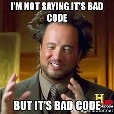

#[MVP] Algorithm editor for testing chatbots

- [ ] Front part (MVP)
- [ ] Server part (MVP)

- [ ] Refactor Front:
  - [ ] Update architecture
  - [ ] Remove MobX directly from editor, but not from project
  - [ ] Fix links direction: links should be always connected from variable node to main node for correct path animation
  - [ ] Add order option for buttons
  - [ ] Fix 'Backspace' and 'Delete' keys event for variable nodes

- [ ] Refactor Server
    - [ ] Update architecture
    - [ ] Add more abstraction layers
    - [ ] Add more messengers

